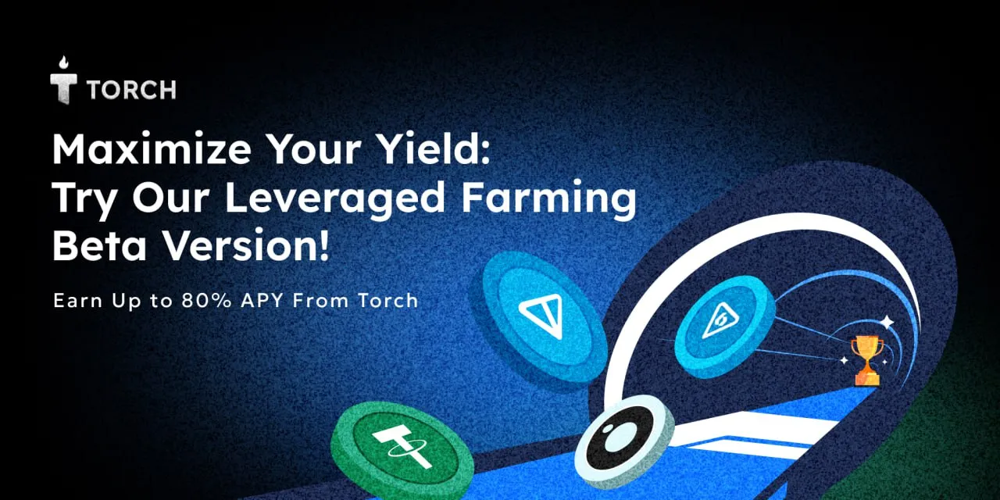

---
layout:
  title:
    visible: true
  description:
    visible: true
  tableOfContents:
    visible: false
  outline:
    visible: false
  pagination:
    visible: true
---

# ☺️ Welcome to Torch

<figure><figcaption></figcaption></figure>

## About Us - Stable Swap on TON 

At **Torch Finance**, we are building the premier **Stable Swap on TON**, dedicated to providing users with ultra-low slippage for USD, Liquid Staking Tokens, and yield token swaps. Our mission is to create a seamless, efficient DeFi experience on TON blockchain.

## Story Behind Leveraged Yield Farming 

TON Foundation injected $24 million to boost DeFi on platforms like DeDust and STON through LST farming pools. Seeing the growing demand and potential for higher returns in these pools, we at Torch Finance decided to take things a step further by launching **leveraged yield farming**.&#x20;

Our goal is to empower users to easily amplify their yields, providing them with a streamlined approach to earn greater rewards in the booming DeFi ecosystem on TON.
