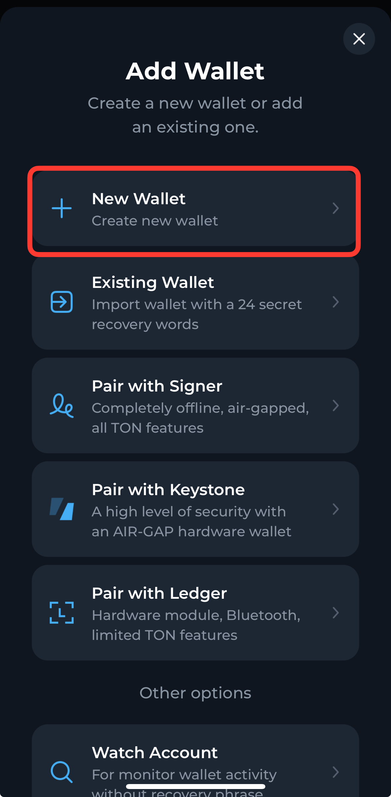
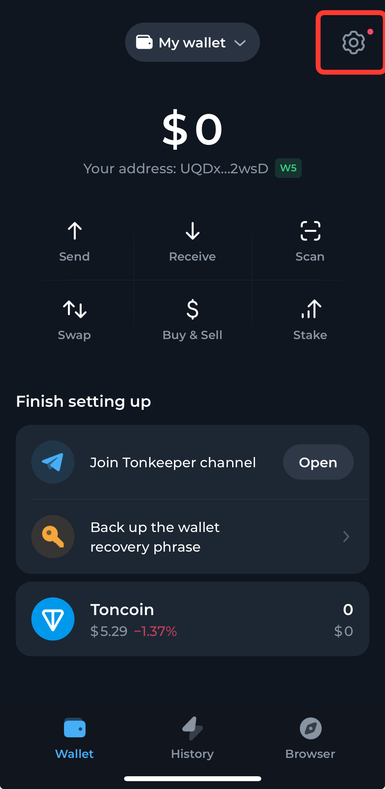
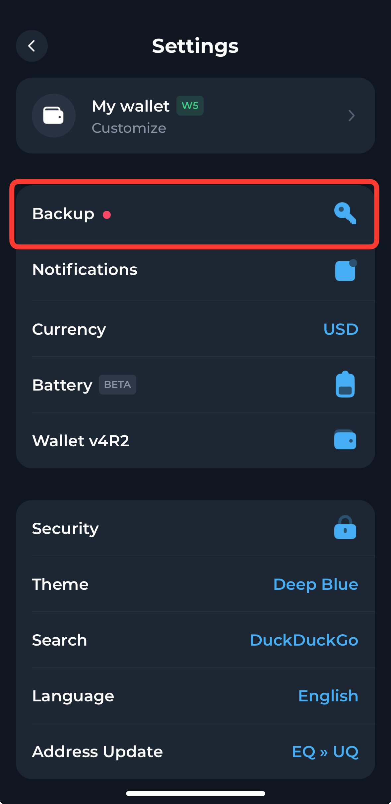
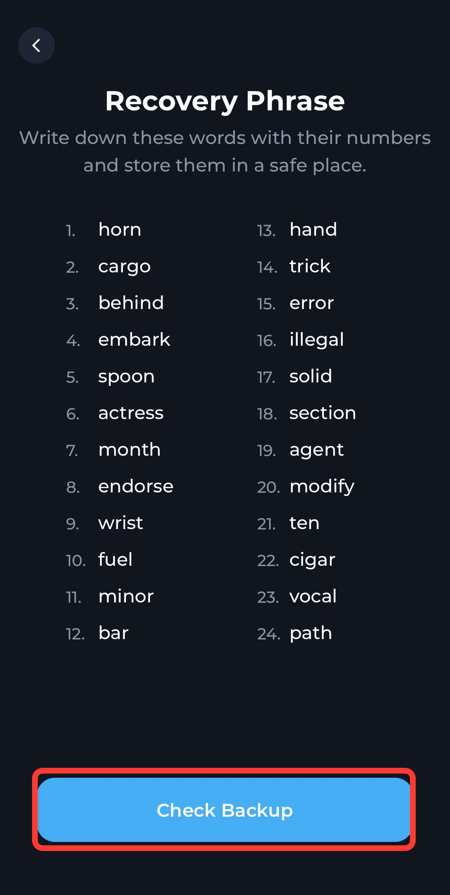
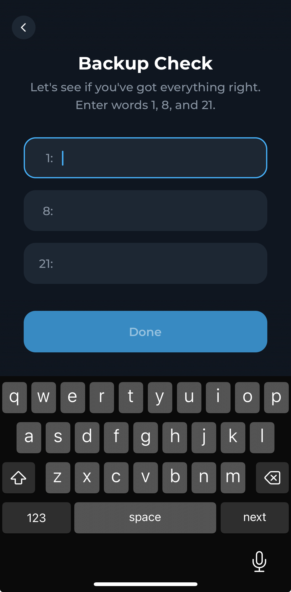
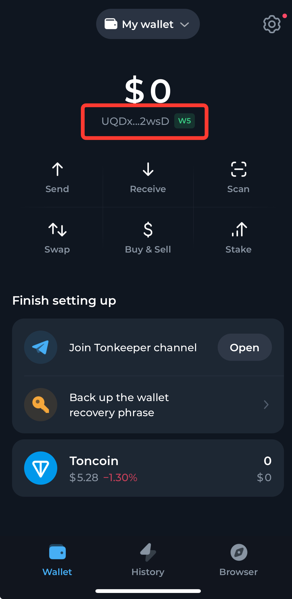

# Wallet Setup

## Step 1: Download [**Tonkeeper**](https://tonkeeper.com/)

* Visit the official [**Tonkeeper**](https://tonkeeper.com/) website or find it in your app store.
* Download and install the latest version of the Tonkeeper wallet.

## Step 2: Create a New Wallet

* Open the app and choose the option to **create a new wallet**.
* Go to setting at the top-right corner of the app and enter the backup page

<figure><figcaption></figcaption></figure>

 

<figure><figcaption></figcaption></figure>

 

<figure><figcaption></figcaption></figure>

## Step 3: Verify Your Seed Phrase

* You’ll be given a **seed phrase**, which is a set of **24 words** that acts as your backup key. Showing it for demo purpose. <mark style="color:red;">**DO NOT SHOW ANYONE YOUR KEY**</mark><mark style="color:red;">.</mark>
* **Write these down** carefully on paper. This is crucial, as losing the seed phrase means losing access to your funds.
* **Verify** your seed phrase by entering the words in the correct order. This step ensures you’ve written it down correctly.

<figure><figcaption></figcaption></figure>

 

<figure><figcaption></figcaption></figure>

## Step 4: Funding Your Tonkeeper Wallet

Now that your wallet is set up, it’s time to **deposit funds**. There are two main methods for adding funds to your wallet.



### Option 1: Using a Centralized Exchange (CEX)

1. **Purchase TON** on a centralized exchange (such as Binance, OKX, etc.).
2. Once you have **TON**, **withdraw** it from the exchange by choosing the **TON blockchain**.
3.  During the withdrawal process, enter your **Tonkeeper and copy wallet address** as the recipient address.

    &#x20;

    <figure><figcaption></figcaption></figure>
4. Confirm the withdrawal, and after a few moments, your funds will appear in your Tonkeeper wallet.



### Option 2: Buy Toncoin Directly in Tonkeeper

1. Open your **Tonkeeper** app and navigate to the **“Buy”** section.
2. Choose to buy Toncoin (TON)




**Notice**

* **Keep Your Seed Phrase Safe**: Never store your seed phrase digitally (on your phone or computer). Always store it offline, such as on paper, to avoid the risk of hacking.
* **Double-check Addresses**: When transferring funds from an exchange, make sure you select the correct **TON blockchain** and enter your Tonkeeper address carefully to avoid errors.
* **Don't spend all your Toncoin!** You'll need to save some to cover gas fees for transactions.


####
