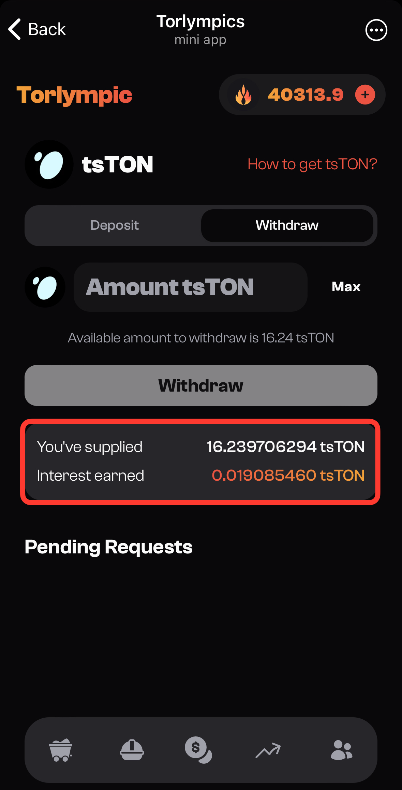

# View Position

After the deposit transaction is completed, you can click the **Withdraw** tab to see your position and the interest you've earned. You have the freedom to **increase** or **reduce** your position at any time. When withdrawing, for each amount of principal you input, we will proportionally return the interest you’ve earned.

<figure><figcaption></figcaption></figure>

> For example, if you’ve supplied **100 tsTON** and earned **2 tsTON** in interest, and you decide to withdraw **40 tsTON**, we will return **40 tsTON** of principal and **40%** of the earned interest, which is **0.8 tsTON**.
